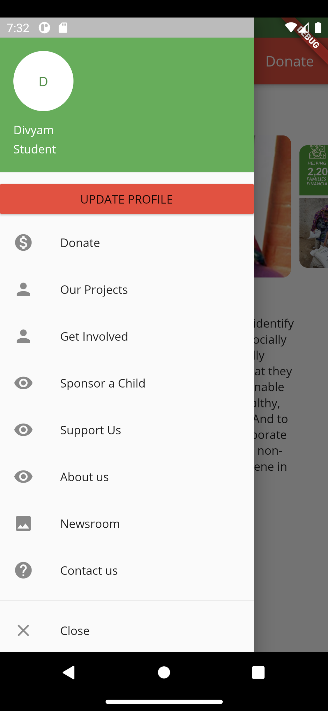

# Deepalaya Mobile Application

## Overview
This mobile application is developed using Flutter for Deepalaya, an NGO, to facilitate a seamless experience for donors. The app allows users to authenticate, access their profiles, receive organizational updates, and manage donations securely through RazorPay.

## Table of Contents

- [Features](#features)
- [Screenshots](#screenshots)
- [Getting Started](#getting-started)
- [Dependencies](#dependencies)
- [Configuration](#configuration)
- [Usage](#usage)
- [Contributing](#contributing)
- [License](#license)

## Features

- **User Authentication:** Firebase is used for secure user authentication.
- **Profile Access:** Donors can access and manage their profiles within the app.
- **Organizational Updates:** Stay informed with the latest updates from Deepalaya.
- **Donation Management:** Utilize RazorPay for easy and secure donation management.

## Screenshots


Launch Screen


Home Page


Menu Page


## Getting Started

To get started with the Deepalya mobile app, follow these steps:

1. **Clone the Repository:**
   ```bash
   git clone https://github.com/DivyamArora22/DeepalayaApp.git

2. **Navigate to Project Directory:**
   ```bash
   cd DeepalayaApp
3. **Install Dependencies:**
   ```bash
   flutter pub get
4. **Run the App:**
   ```bash
   flutter run
   
## Dependencies

- [Flutter](https://flutter.dev/)
- [Firebase](https://firebase.google.com/)
- [Cloud Firestore](https://firebase.google.com/docs/firestore)
- [RazorPay](https://razorpay.com/)

## Configuration

Before running the app, make sure to configure the following:

1. **Firebase authentication with API keys.**
2. **RazorPay configuration with API keys.**

Refer to respective documentation for detailed configuration steps.

## Usage

Welcome to the Deepalya Mobile App! This section will guide you through the various features and functionalities available in the app.

### Side Menu Bar

The side menu bar serves as a gateway to essential features and information within the app. Here's what you can find:

- **User Profile:**
  - View your user profile details.
  - Update your profile information to ensure accuracy.

- **Our Projects:**
  - Explore the ongoing projects undertaken by Deepalya.
  - Gain insights into the impact of these projects on the community.

- **Get Involved:**
  - Discover opportunities to actively participate in Deepalya's initiatives.
  - Volunteer your time or skills to contribute to meaningful causes.

- **Support Us:**
  - Learn about different ways to support Deepalya, including making donations.
  - Access the RazorPay integration for secure and convenient donation management.

- **Contact Us:**
  - Find the contact details for Deepalya.
  - Reach out for inquiries, feedback, or collaboration opportunities.

- **About Us:**
  - Gain a deeper understanding of Deepalya's mission, vision, and values.
  - Learn about the organization's history and the impact it has made.

### Navigating the App

1. **Accessing Side Menu:**
   - Swipe from the left edge of the screen or tap the menu icon to reveal the side menu.

2. **Selecting Options:**
   - Tap on the desired option in the side menu to navigate to specific features or information.

3. **Updating User Profile:**
   - Navigate to "User Profile" in the side menu.
   - Click on the "Update Profile" option to modify your personal information.

4. **Donation Management:**
   - Visit the "Support Us" section in the side menu.
   - Use the RazorPay integration to manage and track your donations securely.

Feel free to explore the app, stay informed about our projects, and actively engage with Deepalya's initiatives. Thank you for your support!

## Contributing

If you'd like to contribute to the project, please follow these steps:

1. Fork the repository.
2. Create a new branch for your feature: `git checkout -b feature-name`.
3. Commit your changes: `git commit -m 'Add new feature'`.
4. Push to the branch: `git push origin feature-name`.
5. Submit a pull request.

## License

This project is licensed under the [MIT License](LICENSE).
